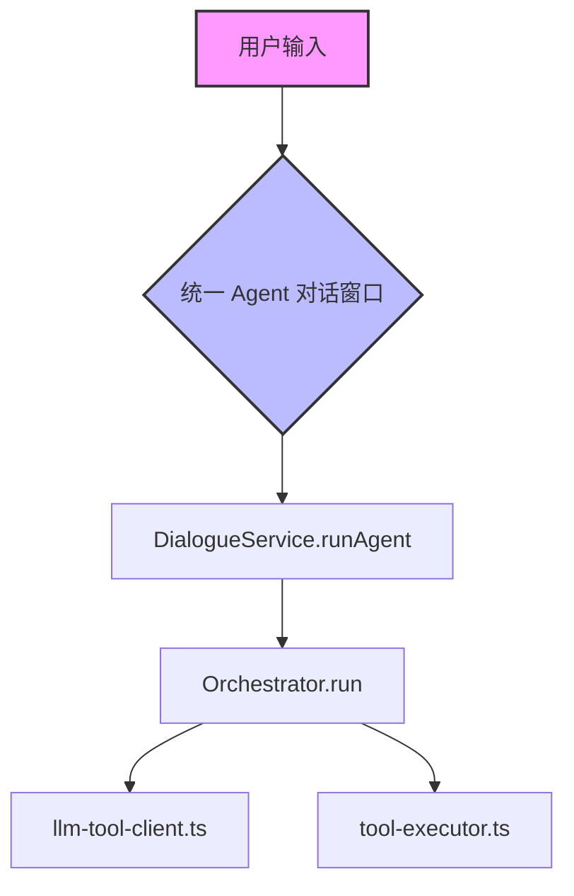

# 小小牛马编程智能体下一步优化与重构方案（详细设计）

本设计文档旨在为小小牛马（Xiao Niu Ma）桌面智能体向“高可靠编程智能体”演进提供详尽的重构与开发指南。本方案重点关注**废弃代码的移除、核心模块的抽象与复用，以及多任务/多工作区环境下的路径安全控制**。

---

## 1. 快速对话与 Agent 模式合并及代码清理方案

### 1.1 核心设计目标
废弃独立的「快速对话」模式，所有会话均采用带工具调用和多轮规划能力的「Agent」模式执行。以此消除大量并行的双轨制代码，降低维护成本，简化界面。



### 1.2 前端代码清理 (Frontend Cleanup)
1. **UI 组件 (`Chat.tsx`)**：
   - **废弃移除**：彻底删除 `ModeSwitch` 切换组件（L222-253）以及对应的 CSS 样式。
   - **空状态简化**：移除 `EmptyState` 中 `mode === 'chat'` 的分支逻辑，默认直接展示橙色像素猫 Agent 引导词与对应的编程类任务示例（如项目扫描、日志总结、代码编写等）。
   - **头部精简**：原右上角的“🧩 技能”与“⏰ 定时”按钮不再受模式条件制约，对所有会话统一开放。
2. **状态管理 (`useChat.ts`)**：
   - **移除废弃变量与接口**：废弃 `mode` 及 `switchMode`，状态默认锁定为 `'agent'`。
   - **废弃更新逻辑**：移除单轮对话专属的流式状态修剪逻辑 `patchMessageById`，以及仅在前端执行的会话保存函数 `persistChatSession`（Agent 模式下由主进程在每次迭代后自动调用 `saveAgentSession` 持久化，无需渲染进程干预）。
   - **状态统一**：所有消息更新均基于 `upsertStreamingAssistant` 与 `attachToolRuns`，极大简化数据同步心智。

### 1.3 后端服务层清理与重构 (Backend Refactoring)
1. **统一分流 (`dialogue-service.ts`)**：
   - **彻底废弃 `runChat`**（L73-108）及其依赖的 `ai-chat-service` 流式调用。
   - `start` 方法中直接调用 `runAgent`，屏蔽所有 `mode` 判断分支。
2. **抽象底层通用 LLM 服务 (`ai-chat-service.ts` $\rightarrow$ `llm-service.ts`)**：
   - 快速对话被废弃后，`ai-chat-service.ts` 不再负责直接与用户聊天，但其中的**流式 SSE 协议解析、Thinking 字段隔离逻辑、API 通信机制**是十分优秀的资产。
   - **重构方向**：将其重命名并抽离为底层基础库 `llm-service.ts`。专为晨间/晚间复盘流程、定时总结任务、以及新增的 `/compact` 永久摘要生成命令，提供统一的、无工具依赖的 LLM 交互接口（支持流式与非流式）。
3. **存储层向前兼容 (`chat-store.ts` 与 `session-store.ts`)**：
   - 统一使用 `agent-sessions/*.json` 存储会话，旧的 `ai-chats/*.json` 将只保留“只读投影”能力。
   - 重构 `chat-store.ts` 的 `listSessions`，当加载 `chat_` 前缀的旧数据时，只读适配为 `ChatMessage` 呈现；但一旦用户在旧会话中发送新消息，系统自动无缝升级转换为 `agent` 格式并写入 `agent-sessions`，删除旧的 `ai-chats` 对应文件。

---

## 2. 项目管理与工作区路径切换设计

为了支持多项目开发，我们需要提供项目注册、选择、以及在各项目路径间安全、无竞态执行的能力。

```
%APPDATA%/xiao-niu-ma/
├── config.json
├── projects.json  <-- 新增：管理所有项目列表
├── agent-sessions/
└── todos/
```

### 2.1 项目模型与配置存储
新增共享类型文件 `src/shared/types-project.ts`，定义 `Project` 接口：
```typescript
export interface Project {
  id: string;          // 唯一标识（默认项目为 'default'，自定义为 'proj_' + 时间戳）
  name: string;        // 项目展示名称
  path: string;        // 本地绝对路径
  createdAt: number;   // 创建时间戳
}
```
在 `%APPDATA%/xiao-niu-ma/projects.json` 下存储项目列表，并在主进程初始化时进行安全审计。

### 2.2 默认项目自动创建与初始化
在 `src/main/chat/project-store.ts` 中维护项目数据管理。系统首次启动时自动在用户文档目录下创建并注册默认项目：
- **默认路径**：`~/Documents/xiaoniuma/default` (Windows/Mac 均通过 `app.getPath('documents')` 派生)
- 如果 `projects.json` 不存在或为空，则自动生成如下项并写入：
  ```json
  [
    {
      "id": "default",
      "name": "默认项目",
      "path": "/Users/user/Documents/xiaoniuma/default",
      "createdAt": 0
    }
  ]
  ```

### 2.3 会话与项目归集
- **Session 关联**：在 `AgentSession` 和 `ChatSession` 数据结构中新增 `projectId?: string` 字段（默认缺省为 `'default'`）。
- **前端过滤**：会话历史列表加载时，向 `CHAT_LIST_SESSIONS` IPC 传递当前选中的 `projectId`。主进程仅返回关联了该项目的会话。
- **添加项目**：允许用户选择本地已有的文件夹关联为项目，或一键在 `~/Documents/xiaoniuma/<项目名>` 创建新项目。
- **删除项目**：仅从 `projects.json` 中移除项目索引（不删除本地物理文件），同时将其归属的所有会话的 `projectId` 重置为 `'default'`。

### 2.4 工作目录安全切换与动态白名单机制
在多会话并发执行的情况下，不能使用全局 `process.chdir(path)` 改变主进程的工作区，否则会造成严重的多线程/多会话文件竞态与路径访问越界。
- **重构方案**：将 **“Session Working Directory”** 视为运行时上下文，贯穿整个执行流。
- **Cwd 动态传递**：
  1. `AgentOrchestrator` 初始化或 `run()` 时，依据当前会话所属项目的 `path`，在内存中维护一个只读的 `projectCwd`。
  2. 调用 `executeTool(call, signal)` 时，将 `projectCwd` 作为第三个参数传入：`executeTool(call, signal, this.projectCwd)`。
- **工具路径安全解析**：
  在 `tool-executor.ts` 的各项工具中，凡是接收相对路径（如 `src/index.ts`）的接口，一律使用自定义辅助函数 `resolvePath` 处理：
  ```typescript
  export function resolvePath(p: string, projectCwd: string): string {
    const expanded = expandHome(p);
    return path.isAbsolute(expanded) ? expanded : path.resolve(projectCwd, expanded);
  }
  ```
  在校验安全路径时，`assertSafePath(target, projectCwd)` 同样以 `projectCwd` 为基准解析：
  ```typescript
  const resolved = path.resolve(projectCwd, expanded);
  ```
- **动态白名单**：
  为了避免 Agent 执行诸如 `read_file` 等操作被安全限制误阻拦，在 `security.ts` 的 `getAllowedPaths()` 中，将当前 `projects.json` 中所有已注册的项目根目录动态并入允许访问的白名单列表中。

---

## 3. 上下文 Token 长度与占比显示

为让用户清晰感知上下文使用额度和剩余空间，防止超出上下文窗口上限。

### 3.1 数据流向：LLM 统计 $\rightarrow$ 前端
1. **SSE Token 解析**：在 `llm-tool-client.ts` 中，由于启用了 `stream_options: { include_usage: true }`，SSE 最后一个数据块通常包含如下结构：
   ```json
   {
     "choices": [],
     "usage": {
       "prompt_tokens": 12040,
       "completion_tokens": 850,
       "total_tokens": 12890
     }
   }
   ```
   解析后将其赋值给 `StreamResult.usage` 返回。
2. **事件透传**：
   - 在有工具执行时：通过 `opts.callbacks.onToolStart` 将当前迭代的 `promptTokens` 和 `completionTokens` 发送给 `DialogueService`，再通过 `CHAT_TOOL_EVENT` 的 `phase === 'start'` 载荷发送至前端。
   - 在执行结束时：通过 `onDone` 和 `CHAT_DONE` 将最终的 Token 数据合并发送。
3. **消息元数据持久化**：
   在 `orchestrator.ts` 实例化这一轮的 `assistantMsg` 时，将 Token 使用量永久保存在消息的 `metadata` 字段中：
   ```typescript
   assistantMsg.metadata = {
     iteration: this.stats.iterations,
     promptTokens: result.usage?.prompt_tokens,
     completionTokens: result.usage?.completion_tokens,
     totalTokens: result.usage?.total_tokens,
     maxTokens: 32768 // 可选，由主配置传入
   }
   ```

### 3.2 前端展现
1. **状态更新**：`useChat.ts` 的 `attachToolRuns` 和 `offDone` 事件处理器解析 `promptTokens`，并更新对应 Assistant 消息的 `metadata`。
2. **UI 渲染**：
   在 `Chat.tsx` 的会话 ID 栏旁加入上下文信息面板（引入微缩占比条）：
   ```typescript
   // 从最后一条 Assistant 消息的 metadata 中提取最新的 token 占比情况
   const latestAssistant = [...messages].reverse().find(m => m.role === 'assistant' && m.metadata?.promptTokens);
   const tokenInfo = latestAssistant?.metadata ? {
     prompt: latestAssistant.metadata.promptTokens,
     max: latestAssistant.metadata.maxTokens || 32768,
     ratio: Math.round((latestAssistant.metadata.promptTokens / (latestAssistant.metadata.maxTokens || 32768)) * 100)
   } : null;
   ```
   并在界面上渲染为进度槽：
   ```html
   <div className="chat__token-stats" title={`已用: ${tokenInfo.prompt} / 上限: ${tokenInfo.max}`}>
     <span className="chat__token-label">🧠 Context</span>
     <div className="chat__token-bar-bg">
       <div className="chat__token-bar-fill" style={{ width: `${tokenInfo.ratio}%` }} data-warning={tokenInfo.ratio > 80} />
     </div>
     <span className="chat__token-text">{tokenInfo.ratio}%</span>
   </div>
   ```

---

## 4. 补充指令系统（Slash Commands）

将 slash commands 分为 **“模版快捷插入型”** 和 **“本地状态控制型”**。

| 命令名称 | 触发词 | 类型 | 功能描述 |
|---|---|---|---|
| **永久压缩上下文** | `/compact` | 状态控制 | 触发主进程对当前会话旧消息进行永久总结并折叠，物理清除中间消息 |
| **切换模型** | `/model <name>` | 状态控制 | 切换或查看当前会话绑定的 LLM 模型名称 |
| **推理强度** | `/effort <level>`| 状态控制 | 调整 Reasoning 模型的推理深度（`low` / `medium` / `high`） |
| **计划模式** | `/plan` | 模版插入 | 引导 Agent 优先在本地工作区编写实施计划，获得批准前禁止修改代码 |
| **命令帮助** | `/help` | 模版插入 | 展出常用命令的用法与安全策略简介 |

### 4.1 `/compact` 物理压缩实现机制
相较于每次请求前内存压缩的 `context-compressor.ts`，永久压缩会永久修改数据库。
- **触发流程**：前端截获输入框提交 `/compact` 时，不发送 `CHAT_START`，而是调用 `api.invoke('chat:compact-session', sessionId)`。
- **主进程逻辑**：
  1. 读取会话的历史消息列表。若条数少于 6 条则直接返回。
  2. 提取除首条 User 消息（保留初始上下文）和最近 4 条消息（保留近期上下文）之外的**中间消息段**。
  3. 调用 `llm-service.ts`，发送专门的非流式总结指令，将这一段历史转换成简短摘要（限 400 字）。
  4. 将这中间的数十条消息替换为一条特殊的 User 消息：`[早期会话已手动压缩，以下为前情概要]：...`。
  5. 物理覆盖写入 JSON 会话，完成后给前端回执，前端重载展现。

---

## 5. 工具调用截断 Bug 深度排查与修复方案

### 5.1 Bug 根源分析
在 `llm-tool-client.ts` 的流式处理器中，为防止大模型的思维链 `<think>` 标签以及 XML 标签在流传输过程中被中间切断，`ThinkSplitter` 在 `push()` 方法中做了一道“安全保留缓冲区”的处理：
```typescript
// 防止 </think 标签被截断在 buffer 末尾，保留最后 8 字符
const safeLen = Math.max(0, this.buffer.length - 8)
reasoning += this.buffer.slice(0, safeLen)
this.buffer = this.buffer.slice(safeLen)
```
这会导致有约 7-8 个字符在 SSE 循环期间一直积压在缓冲中，不向 `onDelta` 发送。
在 SSE 连接关闭后，虽然执行了：
```typescript
const tail = splitter.flush() // 彻底排出缓存中积压的 7-8 字符
if (tail.content) fullContent += tail.content
```
这保证了 `StreamResult.content`（保存在主进程 history 里的数据）是**完整**的。但由于在此之后**没有触发 `params.onDelta`**，所以这最后一波 `tail.content` 根本没有向渲染进程（UI）推送！

当该轮 LLM 产出包含工具调用时，Orchestrator 接收到 `StreamResult` 后直接进入了 `executeTool` 环节。这导致前端页面展现的文本永远遗留了最后几个字符的截断缺损。

### 5.2 修复方案
1. **主进程端补偿推送 (`llm-tool-client.ts`)**：
   在 SSE 循环退出后的 `flush` 收尾逻辑中，如果 `tail` 含有数据，必须补偿触发 `onDelta`！
   ```typescript
   const tail = splitter.flush();
   if (tail.reasoning || tail.content) {
     if (tail.reasoning) fullReasoning += tail.reasoning;
     if (tail.content) fullContent += tail.content;
     
     // 核心修复：将收尾数据安全推送至前端
     if (params.onDelta) {
       params.onDelta({ 
         content: params.tools.length > 0 ? stripFallbackToolTags(fullContent) : fullContent, 
         reasoning: fullReasoning 
       });
     }
   }
   ```
2. **前端流式状态标志修复 (`useChat.ts`)**：
   在 Agent 多轮循环中，第一轮 LLM 文本流结束后，往往立刻进入工具执行状态，此时没有触发 `CHAT_DONE`。前端需要在收到工具即将启动的事件时，主动关闭流式状态：
   ```typescript
   const offTool = api.on(IPC.CHAT_TOOL_EVENT, ((p: ChatToolEventPayload) => {
     if (!mine(p.sessionId)) return;
     if (p.phase === 'start' && typeof p.iteration === 'number') {
       // 核心修复：工具执行一旦开始，确认上一阶段的流文本已经完全结束，重置流占位状态
       setMessages(prev => prev.map(m => 
         (m.role === 'assistant' && m.iteration === p.iteration) 
           ? { ...m, streaming: false } 
           : m
       ));
       attachToolRuns(p.iteration, p.toolCalls);
     }
     ...
   }));
   ```

---

## 6. 测试与验证计划

为确保以上重构和重度代码清理不引起系统回归，执行以下验证测试：

### 6.1 单元测试与接口编译校验
- **路径重映射编译检查**：
  ```bash
  cd src/main/agent/
  npx tsc --noEmit
  ```
  确保所有涉及 `projectCwd` 和 `resolvePath` 签名的代码没有类型遗漏。

### 6.2 关键行为人工复核用例
1. **模式合并验证**：启动后，应用导航至对话页。验证没有出现快速对话/Agent 切换开关。发送“你好”，验证是否直接拉起 Agent 工具栈并能正常对话。
2. **工作区关联及白名单越界测试**：
   - 添加一个自定义本地目录作为项目（例如：`/Users/user/workspace/demo`）。
   - 让 Agent 对话：`在项目根目录下创建一个 test.js 文件`。
   - 验证：文件是否被创建在 `/Users/user/workspace/demo/test.js`。
   - 发送：`读取 ~/Desktop/password.txt`，验证白名单安全校验是否如期进行并给予拦截提示。
3. **截断 Bug 测试**：
   - 让 Agent 写一长串话，在它需要调用工具前（如写一段话并存入 todo），仔细核对前端 UI 的最后一个标点符号与 Jarvis Studio Trace 日志中的 `llm.call` output 字符串，验证字符数量是否达到 100% 字节一致。
4. **Token 显示测试**：
   - 发送 2 轮以上的上下文对话，核对右上角的 `🧠 Context` 状态数值是否随着对话历史变长而正确累积，且不超过设定上限。

---

## 7. 与 Claude Code 同类功能实现的对比与参考

本方案中多个关键模块的设计思想直接对标并借鉴了 Claude Code 源码的工程实践，具体映射如下：

### 7.1 指令系统与计划模式 (`/compact` & `/plan`)
- **Claude Code 原理**：
  - Claude Code 的 `/compact` 指令（见 `commands/compact/compact.ts`）在检测到 Tokens 压力或人工触发时，首先运行 `microcompact`（去除无用空白），接着通过 `compactConversation` 对旧历史调用 LLM 进行非对称摘要，最后利用 `setLastSummarizedMessageId` 重构会话列表。
  - `/plan` 指令（见 `commands/plan/plan.tsx`）通过将内部 `appState` 的模式从 `'default'` 切换到 `'plan'`，改变了工具调用上下文中的安全策略（`prepareContextForPlanMode`），并调用外部编辑器让用户编辑临时计划文件。
- **本方案适配**：
  - 本方案中的 `/compact` 借鉴了其非对称摘要的思想，在主进程通过 `llm-service.ts` 的非流式请求将旧历史做概括，直接在 JSON 中抹去旧数据并代以一条摘要气泡，使得 Electron 客户端的存储与交互更轻量。
  - `/plan` 摒弃了 Claude Code 中基于 React Ink 终端终端渲染和全局 state 状态机锁定的复杂逻辑，改用轻量化的**“提示词模式注入”**。通过预置 Prompt 强制引导 Agent 在本地工作区创建 `plan/proposal.md` 并不做其他修改，完美在 Electron GUI 中复现了计划模式的安全限制效果。

### 7.2 上下文管理与工具指纹化 (`context-compressor.ts`)
- **Claude Code 原理**：
  - Claude Code 在大长对话下，使用 `Function Result Clearing` 策略将一些几轮前的只读工具调用结果（如巨大的 `cat` / `read_file` 返回内容）物理清理，仅保留首行摘要以节省 Prompt 空间。
- **本方案适配**：
  - 本方案中既有的 `context-compressor.ts` 设计即是对标这一原理。其“阶段 0：工具结果指纹化”会随着上下文总长度自动触发，将较早的 `tool` 消息体内容削减为 `[工具结果已清理 - ...] 引用`，只保留最新的数个只读工具输出，该算法是完全本地、确定性的，从而在不增加 LLM 交互开销的前提下极大地降低了 Prompt Caching 不一致概率。

### 7.3 工作目录传递与安全边界 (`projectCwd` & `assertSafePath`)
- **Claude Code 原理**：
  - Claude Code 在 `ToolUseContext` 中携带 `additionalWorkingDirectories`。它的所有文件读写和 Shell 工具（如 `BashTool`）不依赖在系统进程层面频繁切换 `process.chdir`，而是将上下文对象向下层层分发，在执行的最终叶子节点由白名单逻辑进行绝对路径的强制校验。
- **本方案适配**：
  - 本方案完全借鉴了这种非全局式（并发安全）的工作区路径判定设计。我们在 `AgentOrchestrator` 内维护 `projectCwd`，并将其顺着 `executeTool` 传导到各工具函数的具体实现。在工具解析任何相对路径时，先与其进行绝对路径拼合，再经过 `assertSafePath` 判定其是否在 `projects.json` 下的已注册项目白名单边界内，解决了并发对话时的竞态安全问题。

